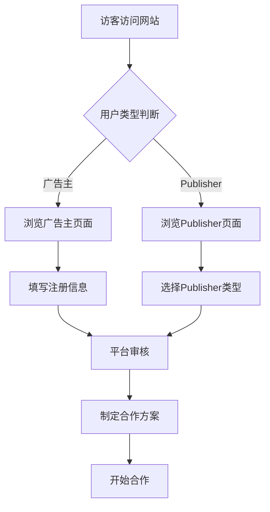

# VSCommission.de 联盟营销平台官网 - 产品需求文档（PRD）

## 1. 产品概述

VSCommission.de 是一家面向德语区市场（德国、比利时、奥地利、荷兰）的专业联盟营销平台官网。平台连接广告主（独立站商家与亚马逊商家）与多元化 Publisher（Coupon、Cashback、Media Buying、PPC、Influencer、Content、Email、Display、Mobile、App），帮助品牌方在德语区市场实现高效业绩增长。

* **核心目标**：打造专业、可信赖的品牌形象，吸引优质广告主和 Publisher 加入平台

* **目标用户**：德语区的电商品牌广告主、各类型 Publisher/联盟客

* **市场价值**：深耕德语区本地化联盟营销，提供从技术到运营的一站式解决方案

## 2. 核心功能

### 2.1 用户角色

| 角色              | 说明                              | 核心需求              |
| --------------- | ------------------------------- | ----------------- |
| 广告主（Advertiser） | 独立站商家 & 亚马逊商家                   | 获取优质流量、提升销量、品牌曝光  |
| Publisher（联盟客）  | Coupon、Cashback、Influencer 等多类型 | 获取优质品牌合作机会、稳定佣金收入 |
| 普通访客            | 浏览网站了解平台信息                      | 了解平台服务、建立信任       |

### 2.2 功能模块（页面清单）

1. **首页（Startseite）**：Hero区、平台数据、服务概览、合作品牌、Publisher类型、成功案例、CTA
2. **广告主页面（Für Werbetreibende）**：广告主解决方案、服务详情、独立站&亚马逊方案、成功案例
3. **Publisher页面（Für Publisher）**：Publisher类型详解、佣金模式、注册引导、资源工具
4. **品牌合作（Marken & Programme）**：合作品牌展示、行业分类、热门Programme
5. **关于我们（Über uns）**：公司介绍、团队、使命愿景、发展历程
6. **资源中心（Ressourcen）**：博客文章、案例研究、白皮书、行业报告
7. **联系我们（Kontakt）**：联系表单、办公地点、常见问题
8. **法律页面**：Impressum、Datenschutz、AGB、Cookie-Richtlinie

### 2.3 页面详细设计

| 页面名称        | 模块名称        | 功能描述                                                                                  |
| ----------- | ----------- | ------------------------------------------------------------------------------------- |
| 首页          | Hero区域      | 醒目标题、副标题、双CTA按钮（广告主/Publisher注册）、背景视觉                                                 |
| 首页          | 平台数据        | 展示关键数字（Publisher数量、品牌数、佣金发放额、转化率等）                                                    |
| 首页          | 服务概览        | 三大核心服务卡片（广告主服务、Publisher服务、技术平台）                                                      |
| 首页          | 合作品牌        | Logo墙展示（EuropeCar、OTTO、AliExpress、Anker、SHEIN 等）                                      |
| 首页          | Publisher类型 | 网格展示10种Publisher类型及说明                                                                 |
| 首页          | 成功案例        | 2-3个客户成功案例卡片                                                                          |
| 首页          | CTA区域       | 注册引导、联系方式                                                                             |
| 广告主页面       | 解决方案        | 独立站方案、亚马逊方案对比                                                                         |
| 广告主页面       | 服务详情        | Campaign管理、Tracking技术、反欺诈、报表分析                                                        |
| 广告主页面       | 入驻流程        | 4步流程图（咨询→方案→上线→优化）                                                                    |
| Publisher页面 | Publisher类型 | 10种类型详解（Coupon/Cashback/Media Buying/PPC/Influencer/Content/Email/Display/Mobile/App） |
| Publisher页面 | 佣金模式        | CPS、CPA、CPL等模式说明                                                                      |
| Publisher页面 | 注册引导        | 注册步骤、所需资料、审核流程                                                                        |
| 品牌合作        | 品牌展示        | 按行业分类的品牌目录                                                                            |
| 品牌合作        | 热门Programme | 高佣金、高转化的精选Programme                                                                   |
| 关于我们        | 公司故事        | 创立背景、使命、团队介绍                                                                          |
| 资源中心        | 博客列表        | 文章卡片网格、分类筛选                                                                           |
| 联系我们        | 联系表单        | 姓名、邮箱、公司、消息、提交按钮                                                                      |

## 3. 核心流程

### 3.1 广告主入驻流程

1. 访客浏览首页/广告主页面了解服务
2. 点击"Jetzt starten"注册
3. 填写企业信息与推广需求
4. 平台审核并制定方案
5. Campaign上线并持续优化

### 3.2 Publisher入驻流程

1. 访客浏览Publisher页面选择类型
2. 点击"Publisher werden"注册
3. 填写Publisher资料与推广渠道
4. 平台审核资质
5. 加入品牌Programme开始推广



## 4. 用户界面设计

### 4.1 设计风格

**整体定位**：专业、现代、可信赖的B2B SaaS风格，参考 CJ.com 的视觉语言

* **主色调**：

  * 深蓝色系（信任、专业）：#0A2540（深海蓝主色）、#1B4D7E（辅助蓝）

  * 亮色强调（活力、行动）：#00C896（品牌绿/薄荷绿）、#FFB800（金色点缀）

  * 中性背景：#FFFFFF（纯白）、#F8FAFC（浅灰）、#1A1A2E（深色区块）

* **按钮风格**：圆角矩形（rounded-lg），主按钮使用品牌绿填充，次按钮使用边框

* **字体**：

  * 标题字体：Inter Tight / Space Grotesk（现代几何感，但需避免过度使用）

  * 正文字体：Inter（清晰易读）

  * 实际采用：标题用 "Sora"（德语区专业感），正文用 "Inter"

* **布局风格**：顶部固定导航 + 大留白卡片式布局 + 分区色块对比

* **图标风格**：使用 lucide-react 线性图标，统一风格

### 4.2 页面设计概览

| 页面名称        | 模块名称        | UI元素                       |
| ----------- | ----------- | -------------------------- |
| 首页          | Hero区域      | 全宽渐变背景、大标题左对齐、右侧装饰图形、CTA按钮 |
| 首页          | 数据统计        | 深色背景、4列大数字、滚动计数动画          |
| 首页          | 品牌Logo墙     | 白色背景、灰度Logo网格、hover变彩色     |
| 首页          | Publisher类型 | 5×2网格卡片、图标+标题+描述、hover上浮   |
| 广告主页面       | 方案对比        | 双列卡片对比（独立站vs亚马逊）           |
| Publisher页面 | 类型详解        | 左侧图标+右侧内容的横向卡片             |
| 关于我们        | 团队介绍        | 圆形头像网格、hover显示社交链接         |
| 资源中心        | 博客列表        | 3列卡片、封面图+标题+摘要+标签          |

### 4.3 响应式设计

* **桌面优先**：1920px / 1440px / 1280px 三档优化

* **平板适配**：768px-1024px 自适应布局

* **移动端**：375px-768px 移动优先，汉堡菜单，单列布局

* **触摸优化**：按钮最小44px，间距充足

### 4.4 视觉细节

* **背景纹理**：Hero区使用渐变+几何装饰，数据区使用深色噪点纹理

* **阴影系统**：卡片使用柔和的多层阴影（0 4px 6px -1px rgba(0,0,0,0.05)）

* **动画效果**：页面加载时元素淡入上移（staggered），数字计数动画，hover上浮

* **装饰元素**：Hero区使用抽象的连接线条/节点图形，象征联盟网络

## 5. SEO 与站点地图

### 5.1 站点结构（Sitemap）

```
vscommission.de/
├── / (Startseite - 首页)
├── /fuer-werbetreibende (广告主页面)
│   ├── /fuer-werbetreibende/loesungen (解决方案)
│   └── /fuer-werbetreibende/services (服务详情)
├── /fuer-publisher (Publisher页面)
│   ├── /fuer-publisher/typen (Publisher类型)
│   └── /fuer-publisher/registrierung (注册引导)
├── /marken-programme (品牌合作)
├── /ueber-uns (关于我们)
├── /ressourcen (资源中心)
│   ├── /ressourcen/blog (博客)
│   └── /ressourcen/case-studies (案例研究)
├── /kontakt (联系我们)
└── /rechtliches (法律)
    ├── /impressum (法律声明)
    ├── /datenschutz (隐私政策)
    ├── /agb (使用条款)
    └── /cookie-richtlinie (Cookie政策)
```

### 5.2 SEO 优化要点

* 全站德语内容，使用地道德语表达

* 每个页面独立的 title、meta description

* 语义化 HTML（header、nav、main、section、article、footer）

* 结构化数据（JSON-LD）用于 Organization、BreadcrumbList

* 自动生成 sitemap.xml

* 友好的 URL 结构（德语关键词）

## 6. 品牌与案例数据

### 6.1 合作品牌（按行业分类）

| 行业   | 品牌                                   |
| ---- | ------------------------------------ |
| 电商平台 | OTTO、AliExpress、SHEIN、Amazon         |
| 消费电子 | Anker、Eufy、MediaMarkt、Roborock、Aiper |
| 汽车出行 | Europcar                             |
| 健康营养 | Myprotein                            |
| 时尚生活 | SHEIN、OTTO                           |

### 6.2 平台数据（展示用）

* 活跃 Publisher 数量：12.000+

* 合作品牌数：500+

* 年佣金支付额：€25M+

* 平均转化率提升：35%

* 德语区市场覆盖：4个国家

### 6.3 成功案例示例

1. **Anker 德语区增长案例**：通过 Content + Influencer 组合，6个月内销量增长 180%
2. **SHEIN 进入德国市场**：整合 Coupon + Cashback 网络，首月获客 50.000+
3. **Europcar 季节性Campaign**：Summer Campaign 通过 PPC + Display，ROI 达到 1:8

