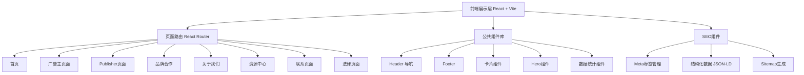

# VSCommission.de 联盟营销平台官网 - 技术架构文档

## 1. 架构设计



## 2. 技术选型

- **前端框架**：React@18 + TypeScript
- **构建工具**：Vite
- **样式方案**：Tailwind CSS@3
- **路由**：react-router-dom@6
- **状态管理**：Zustand（轻量级，用于导航状态等）
- **图标库**：lucide-react
- **动画**：CSS Animations + Tailwind transitions（无需额外动画库）
- **图片**：使用占位图服务，生成品牌相关图片
- **无后端**：纯前端静态网站，便于部署和SEO

## 3. 路由定义

| 路由路径 | 页面名称 | 说明 |
|----------|----------|------|
| `/` | Startseite | 首页 - 平台概览 |
| `/fuer-werbetreibende` | Für Werbetreibende | 广告主页面 - 解决方案与服务 |
| `/fuer-werbetreibende/loesungen` | Lösungen | 解决方案详情 |
| `/fuer-werbetreibende/services` | Services | 服务详情 |
| `/fuer-publisher` | Für Publisher | Publisher页面 - 类型与佣金 |
| `/fuer-publisher/typen` | Publisher-Typen | Publisher类型详解 |
| `/fuer-publisher/registrierung` | Registrierung | Publisher注册引导 |
| `/marken-programme` | Marken & Programme | 品牌合作与Programme |
| `/ueber-uns` | Über uns | 关于我们 |
| `/ressourcen` | Ressourcen | 资源中心首页 |
| `/ressourcen/blog` | Blog | 博客列表 |
| `/ressourcen/case-studies` | Case Studies | 案例研究 |
| `/kontakt` | Kontakt | 联系我们 |
| `/impressum` | Impressum | 法律声明 |
| `/datenschutz` | Datenschutz | 隐私政策 |
| `/agb` | AGB | 使用条款 |
| `/cookie-richtlinie` | Cookie-Richtlinie | Cookie政策 |

## 4. 项目结构

```
vscommission.de/
├── public/
│   ├── robots.txt
│   └── sitemap.xml
├── src/
│   ├── components/
│   │   ├── layout/
│   │   │   ├── Header.tsx          # 顶部导航栏（含下拉菜单）
│   │   │   ├── Footer.tsx          # 底部信息区
│   │   │   └── Layout.tsx          # 全局布局容器
│   │   ├── ui/
│   │   │   ├── Button.tsx          # 按钮组件
│   │   │   ├── Card.tsx            # 卡片组件
│   │   │   ├── Section.tsx         # 区块容器
│   │   │   ├── Badge.tsx           # 标签徽章
│   │   │   └── AnimatedCounter.tsx # 数字计数动画
│   │   ├── sections/
│   │   │   ├── Hero.tsx            # Hero区域
│   │   │   ├── StatsBar.tsx        # 数据统计条
│   │   │   ├── BrandLogos.tsx      # 品牌Logo墙
│   │   │   ├── ServiceCards.tsx    # 服务卡片
│   │   │   ├── PublisherTypes.tsx  # Publisher类型网格
│   │   │   ├── CaseStudies.tsx     # 案例展示
│   │   │   └── CTASection.tsx      # CTA行动召唤
│   │   └── seo/
│   │       └── Seo.tsx             # SEO meta管理
│   ├── pages/
│   │   ├── Home.tsx
│   │   ├── Advertisers.tsx
│   │   ├── AdvertiserSolutions.tsx
│   │   ├── AdvertiserServices.tsx
│   │   ├── Publishers.tsx
│   │   ├── PublisherTypes.tsx
│   │   ├── PublisherRegister.tsx
│   │   ├── Brands.tsx
│   │   ├── About.tsx
│   │   ├── Resources.tsx
│   │   ├── Blog.tsx
│   │   ├── CaseStudies.tsx
│   │   ├── Contact.tsx
│   │   └── legal/
│   │       ├── Impressum.tsx
│   │       ├── Datenschutz.tsx
│   │       ├── AGB.tsx
│   │       └── CookiePolicy.tsx
│   ├── data/
│   │   ├── brands.ts               # 品牌数据
│   │   ├── publisherTypes.ts       # Publisher类型数据
│   │   ├── cases.ts                # 案例数据
│   │   ├── stats.ts                # 统计数据
│   │   └── navigation.ts           # 导航菜单数据
│   ├── hooks/
│   │   └── useScrollAnimation.ts   # 滚动动画hook
│   ├── App.tsx
│   ├── main.tsx
│   └── index.css
├── index.html
├── package.json
├── tailwind.config.js
├── tsconfig.json
└── vite.config.ts
```

## 5. 设计系统

### 5.1 色彩系统

```css
:root {
  /* 主色调 - 深海蓝系 */
  --color-primary: #0A2540;      /* 深海蓝 - 主色 */
  --color-primary-light: #1B4D7E; /* 辅助蓝 */
  --color-primary-dark: #061A2E;  /* 深色背景 */
  
  /* 强调色 */
  --color-accent: #00C896;       /* 品牌绿 - CTA */
  --color-accent-light: #00E5AE; /* 浅绿 - hover */
  --color-gold: #FFB800;         /* 金色点缀 */
  
  /* 中性色 */
  --color-white: #FFFFFF;
  --color-bg-light: #F8FAFC;
  --color-bg-gray: #F1F5F9;
  --color-text-dark: #0F172A;
  --color-text-medium: #475569;
  --color-text-light: #94A3B8;
  --color-border: #E2E8F0;
}
```

### 5.2 字体系统

- **标题字体**：Sora（Google Fonts）- 现代几何感，适合德语
- **正文字体**：Inter（Google Fonts）- 清晰易读

```css
font-family: {
  heading: 'Sora', sans-serif;
  body: 'Inter', sans-serif;
}
```

### 5.3 间距系统

基于 4px 基础单位：
- section padding: py-20 (80px) / py-24 (96px)
- card padding: p-6 (24px) / p-8 (32px)
- 元素间距: gap-4 (16px) / gap-6 (24px) / gap-8 (32px)

## 6. SEO 实现方案

### 6.1 Meta 标签管理

每个页面独立配置：
- `<title>`：德语页面标题
- `<meta name="description">`：德语描述
- `<meta name="keywords">`：德语关键词
- Open Graph 标签
- canonical URL

### 6.2 结构化数据

使用 JSON-LD 格式：
- `Organization`：公司信息
- `WebSite`：网站信息
- `BreadcrumbList`：面包屑导航
- `Service`：服务详情

### 6.3 Sitemap

自动生成 `sitemap.xml`，包含所有页面路由，设置优先级和更新频率。

## 7. 性能优化

- 图片懒加载（loading="lazy"）
- 组件按需加载（非首屏内容）
- CSS 使用 Tailwind PurgeCSS
- 静态资源 CDN 缓存
- 预加载关键字体
